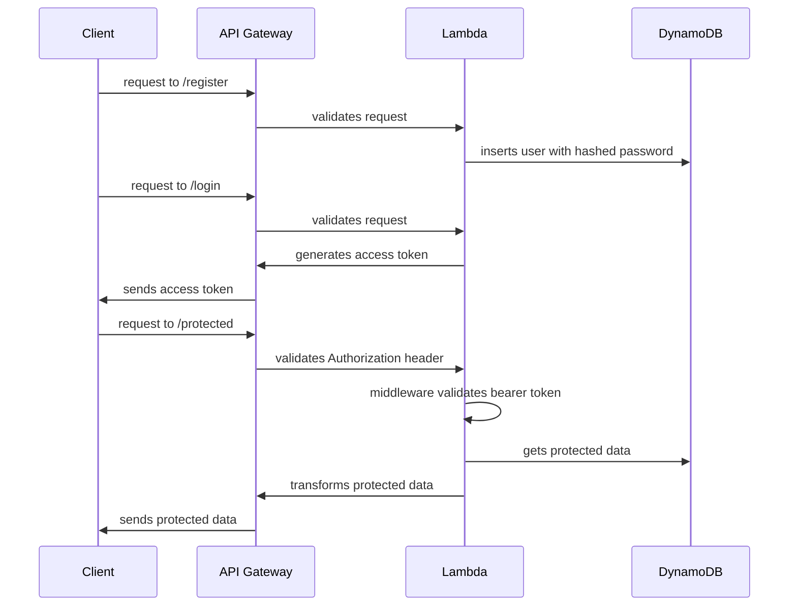

## AWS CDK in Go

Introductory Infrastructure as Code project

Stack:
- **DynamoDB**. Stores user table.
- **Lambda**. Handles register, login and protected routes.
  - `/register`. Receives username and plain text password. Hashes the password and inserts user row into DynamoDB.
  - `/login`. Validates credentials, generates access token and sends it back.
  - `/protected`. Has a middleware that checks for bearer token and, if it's valid, sends back protected data.
- **API Gateway**. Acts as proxy that validates client requests and passes them to Lambda.

Visual representation, because why not:

Big thanks to [Melkey](https://github.com/Melkeydev)
